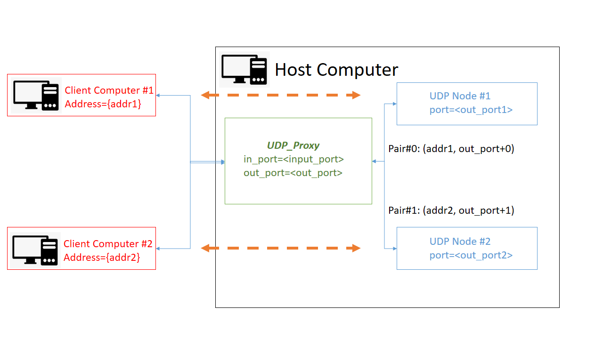

Github Page: [https://github.com/masoud-iranmehr/simple_udp_proxy](https://github.com/masoud-iranmehr/simple_udp_proxy)

# Introduction to simple_udp_proxy
This is a python implementation of the simple_udp_proxy. This code, automatically creates a bidirectional bridge between new
udp connections to a unique udp port by creating a proxy for each new connection.
The total structure of this proxy is illustrated as below:



This package could be used for every UDP nodes and also every nodes using MAVLink protocol such as MAVProxy,
 MissionPlanner, Ardupilot-SITL, PX4-SITL and etc. This package will be very useful for devices that use one port number
 for UDP broadcasting, so that you can use different client UDP applications for receiving their UDP packets separately.

# Installation 

simple_udp_proxy supports both python2 and python3.

## Installing via pip

Just follow these codes:

```bash
pip install -U simple_udp_proxy
```
or

```bash
pip3 install -U simple_udp_proxy
```

The -U parameter allow to update simple_udp_proxy version if it is already installed.

## Installing via git

Just clone the project:

```bash
git clone https://github.com/masoud-iranmehr/simple_udp_proxy
```

### How to use


## Commands

* `python3 simple-udp-proxy.py -h` - Shows available commands for help.
* `python3 simple-udp-proxy.py --i [INPUT_PORT]` - Input UDP port (default = 14550).
* `python3 simple-udp-proxy.py --o [OUTPUT_PORT]` - Initial UDP output port (Other UDP ports start from this UDP port with the incremental of 1) (default = 1220).
* `python3 simple-udp-proxy.py --verbose [VERBOSE]` - D: Disable Verbose, 1: Enable Verbose (Make all output logs visible).
* `python3 simple-udp-proxy.py --log [LOG]` - 0: Disable Logging, 1: Enable Logging.

Example:

* `python3 simple-udp-proxy.py --i 14520 --o 4520 --log 1 -- verbose 1` - Creates a proxy in 14520 UDP port and forwards to ports starting from 4520

The structure would be as follow:

    client node with port 5678   <---> PROXY in 14520 port   <---> APPLICATION#1 host access port with 4520 port
    client node with port 7852   <---> PROXY in 14520 port   <---> APPLICATION#2 host access port with 4521 port
    ...
    ...
    ...

## Python code

Just follow "test/test.py" as below:

* `python3 test/test.py`

The code is as below:

    from simple_udp_proxy import simple_udp_proxy as px
    px.is_verbose = True
    px.is_log_enabled = True
    proxy = px.UdpProxy(in_port=14550, out_port=1220, buf_size=1024)
    while True:
        pass

# License

The source code generated by Masoud Iranmehr (@masoud-iranmehr) is available under the permissive MIT License.


